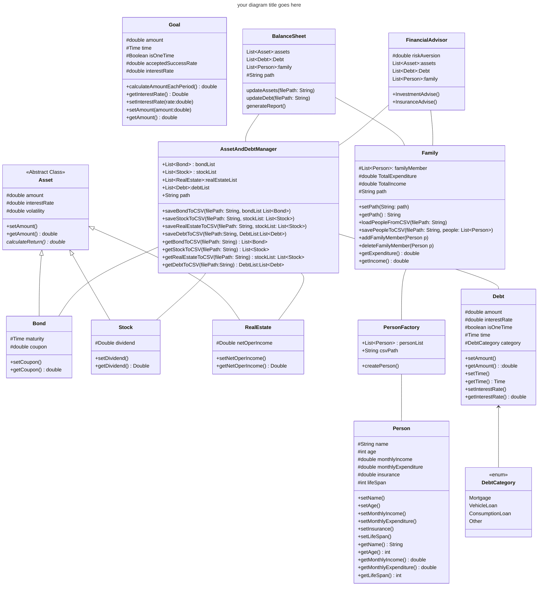
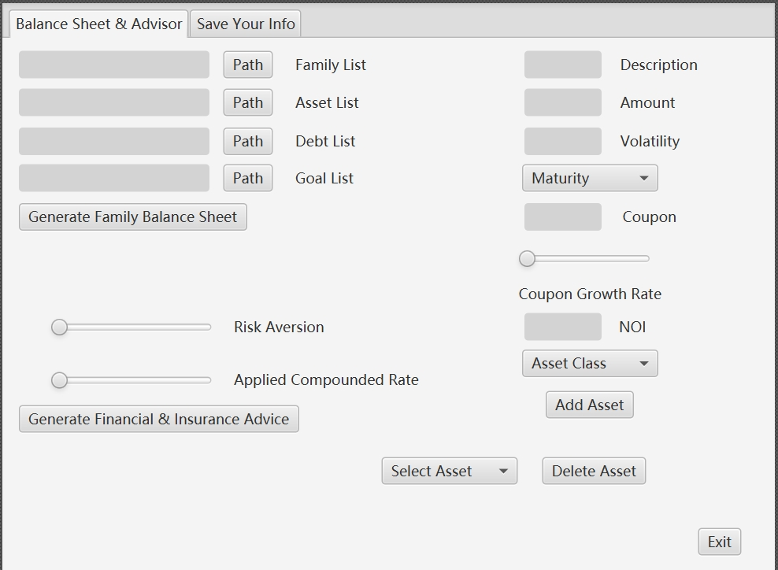
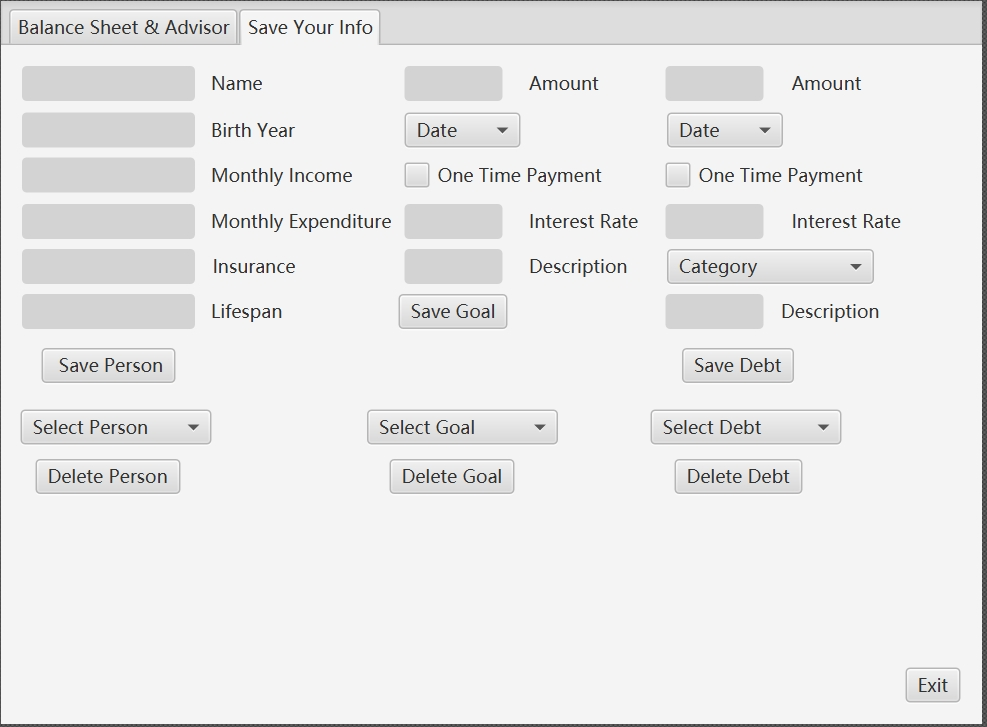
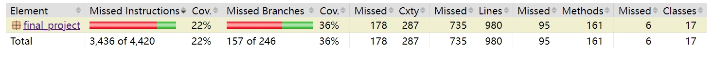
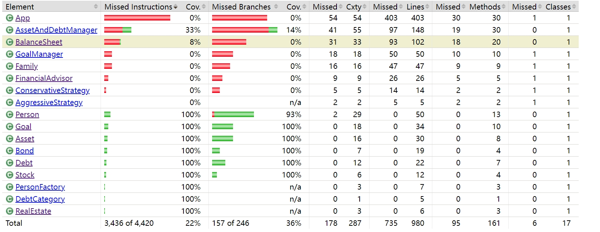
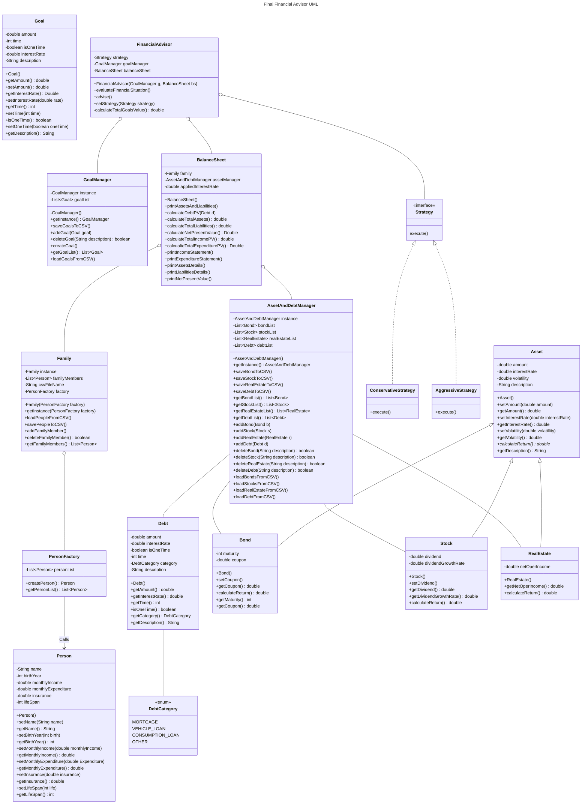

# Final Project 📖📚✍️✅💯🎓

Objectives:

In this project you will:

* Demonstrate your mastery of OOD to solve a challenging problem
* Design a solution with MVC architecture with Swing
* Apply all (or most) of the programming concepts used in this course
* Use design patterns to raise cohesion and lower coupling as well as to avoid re-inventing the wheel
* Meet objectives of prior assignments

## On Groups

This project can be completed individually or with a group of up to three (3) people. If the latter, the work done must be worthy of the additional personnel i.e. if one student could have completed this by themselves then the final grade will be halved (or by two-thirds).

## Part 1: The Idea

Think of three (3) real problems that excite you. Consider for example:

* a problem that you're encountering at work
* an issue that you run into daily in your usual routine
* a CS problem that sparks your curiosity
* a challenge from when you were an undergraduate
* a new unique game you want to develope

This project is a culmination of all of you've learned in this class including Object-Oriented Design, Testing, UML, Design Patterns, and most importantly is a showcase for MVC requiring Swing.

Should you want to do some data visualization (like with NumPy or Pandas in Python) a widely used tool for Java is [JFreeChart](https://www.jfree.org/jfreechart/samples.html) or [Figma](https://www.figma.com/). These tools are not a replacement for Swing but can be used to create mock up of what you want your final visual to look like.

If you're working with a team - each member should come up with three (3) unique ideas.

Share your ideas on a private Piazza post, visible to the Instructors and the other members of your team, *by the date recommended in Canvas*. We will discuss with you the feasiblity and difficulty of implementing each idea, raising the bar if the problem is too simple, or lowering it if too complicated. If an idea you selected already has many examples online, like on StackOverflow, we will veto it. Finally, we'll recommend to the group which idea would make for the best project. If you dislike any requirements that we add, your group can suggest new ideas until all parties are satisfied.

You cannot proceed to Part 2 until Part 1 is approved.

## Part 2: The Design

This is where you will design a UML Class Diagram that your team will submit here on this README.md written in Mermaid. Use every tool to ensure that the system that you design follows proper OOD principles, is well organized, appears highly cohesive, and lously coupled. Your use of Design Patterns needs to be indicated with UML Notes as part of the diagram.




The second half of this part is a mock-up of what you want your application to look like using a tool like [SceneBuilder](https://gluonhq.com/products/scene-builder/). Add these files to the repo and include screenshots of your renderings below.






No actual Java code will be written for this part. Submit everything here on GitHub by the date recommended on Canvas. The teaching teach will provide rapid feedback on your diagram and Views. You can move on to Part 3, just be aware that you may need to change things if the Teaching Team finds issues.

## Part 3: Implementation

A failure to plan is a plan to fail -- but you've done all of the planning, now is the time to build it 😎

There is also a codewalk where you will meet with the Instructors to go over your mostly completed application and get feedback all aspects, including design, Views, missing components, etc., that will need to be addressed before submitting a final result.

## Documentation and Testing

Your project needs to follow the Google style format and reach 70% code coverage from your testing on components not related to the View/Control. You are expected to show a screenshot from your JaCoCo coverage report below, identifying the level of code coverage.


Image Rendering Syntax:





```markdown
Dear Grader, the current testing level is the best I can do, because I used a few design patterns that are difficult to test
(Singleton Pattern and Composite Pattern), and because mocking does not support Junit5, I cannot test IO operations.
App.java contains the entire GUI logic and cannot be tested.
And because several manager classes not only involve IO operations, but also reference each other,
it is even more difficult to test. Please take this into consideration when grading.
```


## UML & Design Patterns




Also fill in the table below explaining the design patterns that you used in your application.

| Pattern Name | Class(es) | Justification |
| :--------: | ------- | :------- |
| ExamplePattern1 | `Listing`, `Agent` | This pattern allowed for a seperation of duties between the different types of `Property` so that the `Agent` could list multiple types of `Property` without needing to be concerned with the type or writting special code inside of `Listing` following the guidance of encapsulating tasks. |
| Singleton | `Family`, `AssetAndDebtManager`, `GoalManager` | Throughout the project I ensured that there was only one instance of `Family` class, `AssetAndDebtManager` class and `GoalManager` class. These classes are used to manage lists corresponding to `Person` and `Asset`, and provide functions such as adding, deleting, and saving to CSV. Only one `Family` instance is needed to manage all `Person` objects. |
| FactoryMethod | `PersonFactory` | The `PersonFactory` class uses the factory method pattern to create a `Person` class object and adds it to the Person list that comes with the factory class after creation. |
| Composite | `BalanceSheet` | Composite Pattern is used to represent the part-whole hierarchy of objects. It can help manage and organize complex structures. The `BalanceSheet` class contains a `Family` class and `AssetAndDebtManager` class instances to manage combinations of family members, assets and liabilities. |
| Strategy |  `FinancialAdvisor` | In the `FinancialAdvisor` class, I implement the strategy pattern, which selects `ConservativeStrategy` or `AgresiveStrategy` based on the family's financial situation (whether the current Asset is greater than Debt+Goal) |

## Reflection

Each member of your group needs to provide an answer to *each* question and be sure to clearly identify whose response is whose.

1. Describe one lesson from this course and how it impacted this project.

Answer: The most important knowledge I learned from the entire course is design patterns and design principles (such as Open-Close Principle and Single Responsibility Principle). Before coming into contact with this knowledge, my overall architecture design was often a mess. These standardized designs make my code more concise and robust


2. What part of this assignment did you find the most challenging and why?

Answer: Implementing the GUI interface is the hardest part. Because GUI is only mentioned a little bit at the end of the course, and it is difficult to design a GUI to call the correct classes and methods, taking into account the position of each button and input box, and also taking into account the user's incorrect input.

3. Assume that you are doing this project over again, what element(s) would you change and how?

Answer: If I have more time to improve the design, I will enrich the design of the Debt class (split it into more subclasses to have different features and business logic, instead of just using DebtCategory for simple classes as now distinction). I will also treat Bond as an abstract class. There are many implementation classes below: FixedRateBond, FloatingRateBond, CallableBond and PutableBond. I'd also like to add more features to my overall project, such as taking retirement timing into account and making recommendations for pensions and annuities.

4. How did the process of this assignment, specifically completing Part 2 before starting Part 3, impact your learning?

Answer: I think communicate with the instructor about UML in advance, including guiding me which attributes should be set to private, what parts should be provided by Abstract Class, etc. Then doing the final design makes me write code faster and the design is more complete and effective. However, professor Veliz always responds to messages late at night, when I have already gone to bed, and when I get up the next day to respond to messages, I usually have to wait until late at night.

5. Think back on what you knew before starting this course and what you know now. What advice would you tell your younger self having completed this project?

Answer: I would give the following advice to my younger self: practice more (especially Stream and Lambda expressions), practice more Leetcode algorithms. Learn more Java frameworks and necessary skills (in addition to Gradle, I have learned Spring and Oracle databases, and the next plan is Linux basic operations, JavaScript and Maven framework).
I would say to my younger self: C language lacks cross-platform and many standard libraries and tool support. Be sure to have a deep understanding of Java. You will not regret choosing Java as your major language!


## Accountability

Qinghao Yang completed the entire Project alone
